# Service: auth (generated)

<!-- AUTO-GENERATED from the model by @voxgig/build (doc_gen) - do not edit. -->

Answers `aim:auth`, `aim:web` messages, loaded by convention (`@voxgig/system` MakeSrv): each
message maps to the action file named after its last pattern pair.

## Messages

| Message | Action file |
|---|---|
| `aim:auth,get:info` | `get_info.ts` |
| `aim:auth,signin:user` | `signin_user.ts` |
| `aim:auth,signout:user` | `signout_user.ts` |
| `aim:auth,load:auth` | `load_auth.ts` |
| `aim:auth,change:pass` | `change_pass.ts` |
| `aim:auth,update:user` | `update_user.ts` |
| `aim:auth,remind:pass` | `remind_pass.ts` |
| `aim:auth,create:apikey` | `create_apikey.ts` |
| `aim:auth,list:apikey` | `list_apikey.ts` |
| `aim:auth,revoke:apikey` | `revoke_apikey.ts` |
| `aim:web,on:cag,load:tree` | `web_load_tree.ts` |
| `aim:web,on:cag,plan:sync` | `web_plan_sync.ts` |
| `aim:web,on:auth,signin:user` | `web_signin_user.ts` |
| `aim:web,on:auth,signout:user` | `web_signout_user.ts` |
| `aim:web,on:auth,load:auth` | `web_load_auth.ts` |
| `aim:web,on:auth,change:pass` | `web_change_pass.ts` |
| `aim:web,on:auth,update:user` | `web_update_user.ts` |
| `aim:web,on:auth,remind:pass` | `web_remind_pass.ts` |
| `aim:web,on:auth,create:apikey` | `web_create_apikey.ts` |
| `aim:web,on:auth,list:apikey` | `web_list_apikey.ts` |
| `aim:web,on:auth,revoke:apikey` | `web_revoke_apikey.ts` |
| `aim:web,on:cag,list:room` | `web_list_room.ts` |
| `aim:web,on:cag,load:room` | `web_load_room.ts` |
| `aim:web,on:cag,list:track` | `web_list_track.ts` |
| `aim:web,on:cag,load:track` | `web_load_track.ts` |
| `aim:web,on:cag,list:speaker` | `web_list_speaker.ts` |
| `aim:web,on:cag,load:speaker` | `web_load_speaker.ts` |
| `aim:web,on:cag,list:appearance` | `web_list_appearance.ts` |
| `aim:web,on:cag,load:appearance` | `web_load_appearance.ts` |
| `aim:web,on:cag,list:snapshot` | `web_list_snapshot.ts` |
| `aim:web,on:cag,load:snapshot` | `web_load_snapshot.ts` |

## Flow

```mermaid
flowchart LR
  gateway{{gateway}} -->|validated msg| srv[srv auth]
  srv --> get_info["aim:auth,get:info<br>get_info.ts"]
  srv --> signin_user["aim:auth,signin:user<br>signin_user.ts"]
  srv --> signout_user["aim:auth,signout:user<br>signout_user.ts"]
  srv --> load_auth["aim:auth,load:auth<br>load_auth.ts"]
  srv --> change_pass["aim:auth,change:pass<br>change_pass.ts"]
  srv --> update_user["aim:auth,update:user<br>update_user.ts"]
  srv --> remind_pass["aim:auth,remind:pass<br>remind_pass.ts"]
  srv --> create_apikey["aim:auth,create:apikey<br>create_apikey.ts"]
  srv --> list_apikey["aim:auth,list:apikey<br>list_apikey.ts"]
  srv --> revoke_apikey["aim:auth,revoke:apikey<br>revoke_apikey.ts"]
  srv --> web_load_tree["aim:web,on:cag,load:tree<br>web_load_tree.ts"]
  srv --> web_plan_sync["aim:web,on:cag,plan:sync<br>web_plan_sync.ts"]
  srv --> web_signin_user["aim:web,on:auth,signin:user<br>web_signin_user.ts"]
  srv --> web_signout_user["aim:web,on:auth,signout:user<br>web_signout_user.ts"]
  srv --> web_load_auth["aim:web,on:auth,load:auth<br>web_load_auth.ts"]
  srv --> web_change_pass["aim:web,on:auth,change:pass<br>web_change_pass.ts"]
  srv --> web_update_user["aim:web,on:auth,update:user<br>web_update_user.ts"]
  srv --> web_remind_pass["aim:web,on:auth,remind:pass<br>web_remind_pass.ts"]
  srv --> web_create_apikey["aim:web,on:auth,create:apikey<br>web_create_apikey.ts"]
  srv --> web_list_apikey["aim:web,on:auth,list:apikey<br>web_list_apikey.ts"]
  srv --> web_revoke_apikey["aim:web,on:auth,revoke:apikey<br>web_revoke_apikey.ts"]
  srv --> web_list_room["aim:web,on:cag,list:room<br>web_list_room.ts"]
  srv --> web_load_room["aim:web,on:cag,load:room<br>web_load_room.ts"]
  srv --> web_list_track["aim:web,on:cag,list:track<br>web_list_track.ts"]
  srv --> web_load_track["aim:web,on:cag,load:track<br>web_load_track.ts"]
  srv --> web_list_speaker["aim:web,on:cag,list:speaker<br>web_list_speaker.ts"]
  srv --> web_load_speaker["aim:web,on:cag,load:speaker<br>web_load_speaker.ts"]
  srv --> web_list_appearance["aim:web,on:cag,list:appearance<br>web_list_appearance.ts"]
  srv --> web_load_appearance["aim:web,on:cag,load:appearance<br>web_load_appearance.ts"]
  srv --> web_list_snapshot["aim:web,on:cag,list:snapshot<br>web_list_snapshot.ts"]
  srv --> web_load_snapshot["aim:web,on:cag,load:snapshot<br>web_load_snapshot.ts"]
```

Message params are validated from the model (gubu); see
`../../../model/` and `docs/reference/messages.md` at the project root.
