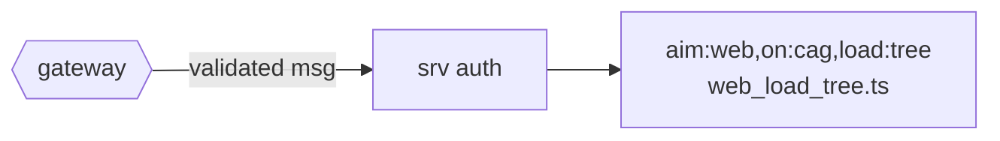

# Service: auth (generated)

<!-- AUTO-GENERATED from the model by @voxgig/build (doc_gen) - do not edit. -->

Answers `aim:auth`, `aim:web` messages, loaded by convention (`@voxgig/system` MakeSrv): each
message maps to the action file named after its last pattern pair.

## Messages

| Message | Action file |
|---|---|
| `aim:web,on:cag,load:tree` | `web_load_tree.ts` |

## Flow

Message params are validated from the model (gubu); see
`../../../model/` and `docs/reference/messages.md` at the project root.
