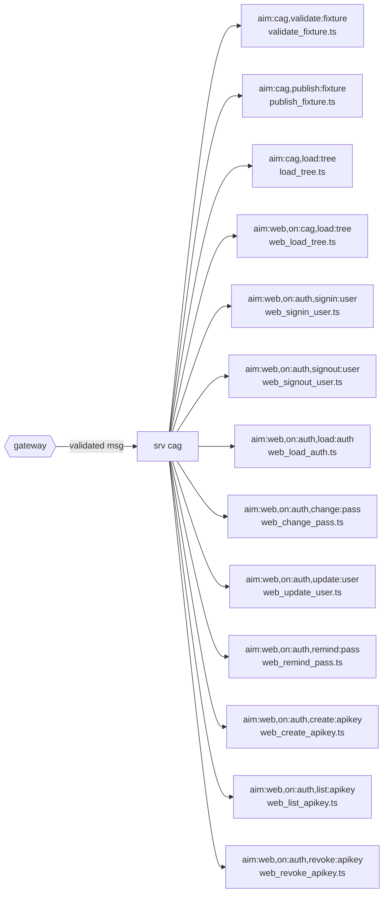

# Service: cag (generated)

<!-- AUTO-GENERATED from the model by @voxgig/build (doc_gen) - do not edit. -->

Answers `aim:cag`, `aim:web` messages, loaded by convention (`@voxgig/system` MakeSrv): each
message maps to the action file named after its last pattern pair.

Requires a signed-in user (`user.required: true`).

## Messages

| Message | Action file |
|---|---|
| `aim:cag,validate:fixture` | `validate_fixture.ts` |
| `aim:cag,publish:fixture` | `publish_fixture.ts` |
| `aim:cag,load:tree` | `load_tree.ts` |
| `aim:web,on:cag,load:tree` | `web_load_tree.ts` |
| `aim:web,on:auth,signin:user` | `web_signin_user.ts` |
| `aim:web,on:auth,signout:user` | `web_signout_user.ts` |
| `aim:web,on:auth,load:auth` | `web_load_auth.ts` |
| `aim:web,on:auth,change:pass` | `web_change_pass.ts` |
| `aim:web,on:auth,update:user` | `web_update_user.ts` |
| `aim:web,on:auth,remind:pass` | `web_remind_pass.ts` |
| `aim:web,on:auth,create:apikey` | `web_create_apikey.ts` |
| `aim:web,on:auth,list:apikey` | `web_list_apikey.ts` |
| `aim:web,on:auth,revoke:apikey` | `web_revoke_apikey.ts` |

## Flow

Message params are validated from the model (gubu); see
`../../../model/` and `docs/reference/messages.md` at the project root.
