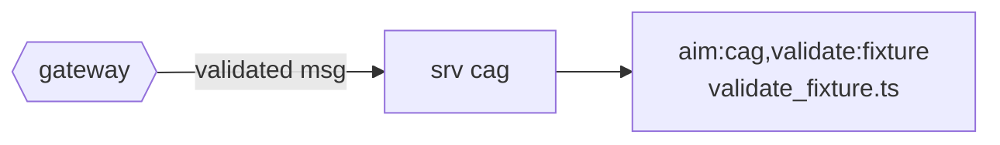

# Service: cag (generated)

<!-- AUTO-GENERATED from the model by @voxgig/build (doc_gen) - do not edit. -->

Answers `aim:cag` messages, loaded by convention (`@voxgig/system` MakeSrv): each
message maps to the action file named after its last pattern pair.

Requires a signed-in user (`user.required: true`).

## Messages

| Message | Action file |
|---|---|
| `aim:cag,validate:fixture` | `validate_fixture.ts` |

## Flow

Message params are validated from the model (gubu); see
`../../../model/` and `docs/reference/messages.md` at the project root.
