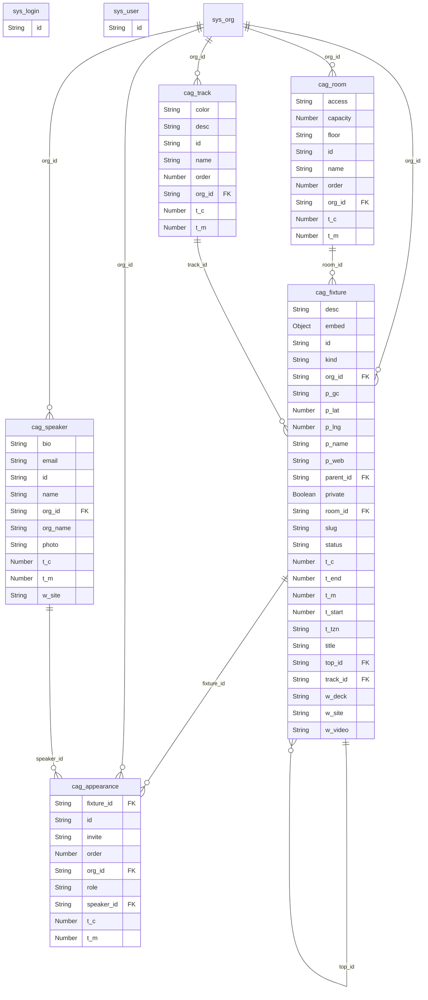

# Reference: entities (generated)

<!-- AUTO-GENERATED from the model by @voxgig/build (doc_gen) - do not edit. -->

*Diátaxis: reference — the entity graph, derived from the model.*

## Entity relationship diagram

Relationships come from `ref` fields (the field stores the id of the
target entity).

(Entity ids are canons with `/` shown as `_`.)

## Entities

| Canon | Fields | Relationships | UI |
|---|---|---|---|
| `cag/appearance` | fixture_id, id, invite, order, org_id, role, speaker_id, t_c, t_m | fixture_id → cag/fixture org_id → sys/org speaker_id → cag/speaker | generic admin |
| `cag/fixture` | desc, embed, id, kind, org_id, p_gc, p_lat, p_lng, p_name, p_web, parent_id, private, room_id, slug, status, t_c, t_end, t_m, t_start, t_tzn, title, top_id, track_id, w_deck, w_site, w_video | org_id → sys/org parent_id → cag/fixture room_id → cag/room top_id → cag/fixture track_id → cag/track | custom view |
| `cag/room` | access, capacity, floor, id, name, order, org_id, t_c, t_m | org_id → sys/org | generic admin |
| `cag/speaker` | bio, email, id, name, org_id, org_name, photo, t_c, t_m, w_site | org_id → sys/org | generic admin |
| `cag/track` | color, desc, id, name, order, org_id, t_c, t_m | org_id → sys/org | generic admin |
| `sys/login` | id | — | generic admin |
| `sys/user` | id | — | generic admin |
