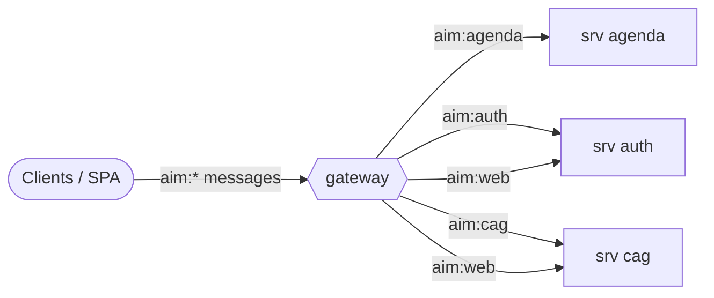

# Reference: messages (generated)

<!-- AUTO-GENERATED from the model by @voxgig/build (doc_gen) - do not edit. -->

*Diátaxis: reference — services and the messages they answer, derived
from the model. Action files follow the MakeSrv convention (last
pattern pair: `save:item` → `save_item`).*

## Message flow

## Service: agenda

| Message | Action file |
|---|---|
| `aim:agenda,get:agenda` | `src/srv/agenda/get_agenda.ts` |
| `aim:agenda,get:feed` | `src/srv/agenda/get_feed.ts` |

## Service: auth

| Message | Action file |
|---|---|
| `aim:auth,get:info` | `src/srv/auth/get_info.ts` |
| `aim:auth,signin:user` | `src/srv/auth/signin_user.ts` |
| `aim:auth,signout:user` | `src/srv/auth/signout_user.ts` |
| `aim:auth,load:auth` | `src/srv/auth/load_auth.ts` |
| `aim:auth,change:pass` | `src/srv/auth/change_pass.ts` |
| `aim:auth,update:user` | `src/srv/auth/update_user.ts` |
| `aim:auth,remind:pass` | `src/srv/auth/remind_pass.ts` |
| `aim:auth,create:apikey` | `src/srv/auth/create_apikey.ts` |
| `aim:auth,list:apikey` | `src/srv/auth/list_apikey.ts` |
| `aim:auth,revoke:apikey` | `src/srv/auth/revoke_apikey.ts` |
| `aim:web,on:cag,load:tree` | `src/srv/auth/web_load_tree.ts` |
| `aim:web,on:cag,plan:sync` | `src/srv/auth/web_plan_sync.ts` |
| `aim:web,on:cag,apply:sync` | `src/srv/auth/web_apply_sync.ts` |
| `aim:web,on:cag,watch:run` | `src/srv/auth/web_watch_run.ts` |
| `aim:web,on:cag,validate:fixture` | `src/srv/auth/web_validate_fixture.ts` |
| `aim:web,on:cag,publish:fixture` | `src/srv/auth/web_publish_fixture.ts` |
| `aim:web,on:cag,move:segment` | `src/srv/auth/web_move_segment.ts` |
| `aim:web,on:cag,set:status` | `src/srv/auth/web_set_status.ts` |
| `aim:web,on:cag,make:segment` | `src/srv/auth/web_make_segment.ts` |
| `aim:web,on:cag,duplicate:segment` | `src/srv/auth/web_duplicate_segment.ts` |
| `aim:web,on:cag,remove:segment` | `src/srv/auth/web_remove_segment.ts` |
| `aim:web,on:cag,add:appearance` | `src/srv/auth/web_add_appearance.ts` |
| `aim:web,on:cag,remove:appearance` | `src/srv/auth/web_remove_appearance.ts` |
| `aim:web,on:cag,make:room` | `src/srv/auth/web_make_room.ts` |
| `aim:web,on:cag,update:room` | `src/srv/auth/web_update_room.ts` |
| `aim:web,on:cag,remove:room` | `src/srv/auth/web_remove_room.ts` |
| `aim:web,on:cag,make:track` | `src/srv/auth/web_make_track.ts` |
| `aim:web,on:cag,update:track` | `src/srv/auth/web_update_track.ts` |
| `aim:web,on:cag,remove:track` | `src/srv/auth/web_remove_track.ts` |
| `aim:web,on:cag,make:speaker` | `src/srv/auth/web_make_speaker.ts` |
| `aim:web,on:cag,update:speaker` | `src/srv/auth/web_update_speaker.ts` |
| `aim:web,on:cag,remove:speaker` | `src/srv/auth/web_remove_speaker.ts` |
| `aim:web,on:cag,update:appearance` | `src/srv/auth/web_update_appearance.ts` |
| `aim:web,on:auth,signin:user` | `src/srv/auth/web_signin_user.ts` |
| `aim:web,on:auth,signout:user` | `src/srv/auth/web_signout_user.ts` |
| `aim:web,on:auth,load:auth` | `src/srv/auth/web_load_auth.ts` |
| `aim:web,on:auth,change:pass` | `src/srv/auth/web_change_pass.ts` |
| `aim:web,on:auth,update:user` | `src/srv/auth/web_update_user.ts` |
| `aim:web,on:auth,remind:pass` | `src/srv/auth/web_remind_pass.ts` |
| `aim:web,on:auth,create:apikey` | `src/srv/auth/web_create_apikey.ts` |
| `aim:web,on:auth,list:apikey` | `src/srv/auth/web_list_apikey.ts` |
| `aim:web,on:auth,revoke:apikey` | `src/srv/auth/web_revoke_apikey.ts` |
| `aim:web,on:cag,list:room` | `src/srv/auth/web_list_room.ts` |
| `aim:web,on:cag,load:room` | `src/srv/auth/web_load_room.ts` |
| `aim:web,on:cag,list:track` | `src/srv/auth/web_list_track.ts` |
| `aim:web,on:cag,load:track` | `src/srv/auth/web_load_track.ts` |
| `aim:web,on:cag,list:speaker` | `src/srv/auth/web_list_speaker.ts` |
| `aim:web,on:cag,load:speaker` | `src/srv/auth/web_load_speaker.ts` |
| `aim:web,on:cag,list:appearance` | `src/srv/auth/web_list_appearance.ts` |
| `aim:web,on:cag,load:appearance` | `src/srv/auth/web_load_appearance.ts` |
| `aim:web,on:cag,list:snapshot` | `src/srv/auth/web_list_snapshot.ts` |
| `aim:web,on:cag,load:snapshot` | `src/srv/auth/web_load_snapshot.ts` |

## Service: cag

| Message | Action file |
|---|---|
| `aim:cag,validate:fixture` | `src/srv/cag/validate_fixture.ts` |
| `aim:cag,publish:fixture` | `src/srv/cag/publish_fixture.ts` |
| `aim:cag,load:tree` | `src/srv/cag/load_tree.ts` |
| `aim:cag,plan:sync` | `src/srv/cag/plan_sync.ts` |
| `aim:cag,apply:sync` | `src/srv/cag/apply_sync.ts` |
| `aim:cag,move:segment` | `src/srv/cag/move_segment.ts` |
| `aim:cag,set:status` | `src/srv/cag/set_status.ts` |
| `aim:cag,make:segment` | `src/srv/cag/make_segment.ts` |
| `aim:cag,duplicate:segment` | `src/srv/cag/duplicate_segment.ts` |
| `aim:cag,remove:segment` | `src/srv/cag/remove_segment.ts` |
| `aim:cag,add:appearance` | `src/srv/cag/add_appearance.ts` |
| `aim:cag,remove:appearance` | `src/srv/cag/remove_appearance.ts` |
| `aim:cag,watch:run` | `src/srv/cag/watch_run.ts` |
| `aim:cag,make:room` | `src/srv/cag/make_room.ts` |
| `aim:cag,update:room` | `src/srv/cag/update_room.ts` |
| `aim:cag,remove:room` | `src/srv/cag/remove_room.ts` |
| `aim:cag,make:track` | `src/srv/cag/make_track.ts` |
| `aim:cag,update:track` | `src/srv/cag/update_track.ts` |
| `aim:cag,remove:track` | `src/srv/cag/remove_track.ts` |
| `aim:cag,make:speaker` | `src/srv/cag/make_speaker.ts` |
| `aim:cag,update:speaker` | `src/srv/cag/update_speaker.ts` |
| `aim:cag,remove:speaker` | `src/srv/cag/remove_speaker.ts` |
| `aim:cag,update:appearance` | `src/srv/cag/update_appearance.ts` |
| `aim:cag,list:room` | `src/srv/cag/list_room.ts` |
| `aim:cag,load:room` | `src/srv/cag/load_room.ts` |
| `aim:cag,list:track` | `src/srv/cag/list_track.ts` |
| `aim:cag,load:track` | `src/srv/cag/load_track.ts` |
| `aim:cag,list:speaker` | `src/srv/cag/list_speaker.ts` |
| `aim:cag,load:speaker` | `src/srv/cag/load_speaker.ts` |
| `aim:cag,list:appearance` | `src/srv/cag/list_appearance.ts` |
| `aim:cag,load:appearance` | `src/srv/cag/load_appearance.ts` |
| `aim:cag,list:snapshot` | `src/srv/cag/list_snapshot.ts` |
| `aim:cag,load:snapshot` | `src/srv/cag/load_snapshot.ts` |
| `aim:web,on:cag,load:tree` | `src/srv/cag/web_load_tree.ts` |
| `aim:web,on:cag,plan:sync` | `src/srv/cag/web_plan_sync.ts` |
| `aim:web,on:cag,apply:sync` | `src/srv/cag/web_apply_sync.ts` |
| `aim:web,on:cag,watch:run` | `src/srv/cag/web_watch_run.ts` |
| `aim:web,on:cag,validate:fixture` | `src/srv/cag/web_validate_fixture.ts` |
| `aim:web,on:cag,publish:fixture` | `src/srv/cag/web_publish_fixture.ts` |
| `aim:web,on:cag,move:segment` | `src/srv/cag/web_move_segment.ts` |
| `aim:web,on:cag,set:status` | `src/srv/cag/web_set_status.ts` |
| `aim:web,on:cag,make:segment` | `src/srv/cag/web_make_segment.ts` |
| `aim:web,on:cag,duplicate:segment` | `src/srv/cag/web_duplicate_segment.ts` |
| `aim:web,on:cag,remove:segment` | `src/srv/cag/web_remove_segment.ts` |
| `aim:web,on:cag,add:appearance` | `src/srv/cag/web_add_appearance.ts` |
| `aim:web,on:cag,remove:appearance` | `src/srv/cag/web_remove_appearance.ts` |
| `aim:web,on:cag,make:room` | `src/srv/cag/web_make_room.ts` |
| `aim:web,on:cag,update:room` | `src/srv/cag/web_update_room.ts` |
| `aim:web,on:cag,remove:room` | `src/srv/cag/web_remove_room.ts` |
| `aim:web,on:cag,make:track` | `src/srv/cag/web_make_track.ts` |
| `aim:web,on:cag,update:track` | `src/srv/cag/web_update_track.ts` |
| `aim:web,on:cag,remove:track` | `src/srv/cag/web_remove_track.ts` |
| `aim:web,on:cag,make:speaker` | `src/srv/cag/web_make_speaker.ts` |
| `aim:web,on:cag,update:speaker` | `src/srv/cag/web_update_speaker.ts` |
| `aim:web,on:cag,remove:speaker` | `src/srv/cag/web_remove_speaker.ts` |
| `aim:web,on:cag,update:appearance` | `src/srv/cag/web_update_appearance.ts` |
| `aim:web,on:auth,signin:user` | `src/srv/cag/web_signin_user.ts` |
| `aim:web,on:auth,signout:user` | `src/srv/cag/web_signout_user.ts` |
| `aim:web,on:auth,load:auth` | `src/srv/cag/web_load_auth.ts` |
| `aim:web,on:auth,change:pass` | `src/srv/cag/web_change_pass.ts` |
| `aim:web,on:auth,update:user` | `src/srv/cag/web_update_user.ts` |
| `aim:web,on:auth,remind:pass` | `src/srv/cag/web_remind_pass.ts` |
| `aim:web,on:auth,create:apikey` | `src/srv/cag/web_create_apikey.ts` |
| `aim:web,on:auth,list:apikey` | `src/srv/cag/web_list_apikey.ts` |
| `aim:web,on:auth,revoke:apikey` | `src/srv/cag/web_revoke_apikey.ts` |
| `aim:web,on:cag,list:room` | `src/srv/cag/web_list_room.ts` |
| `aim:web,on:cag,load:room` | `src/srv/cag/web_load_room.ts` |
| `aim:web,on:cag,list:track` | `src/srv/cag/web_list_track.ts` |
| `aim:web,on:cag,load:track` | `src/srv/cag/web_load_track.ts` |
| `aim:web,on:cag,list:speaker` | `src/srv/cag/web_list_speaker.ts` |
| `aim:web,on:cag,load:speaker` | `src/srv/cag/web_load_speaker.ts` |
| `aim:web,on:cag,list:appearance` | `src/srv/cag/web_list_appearance.ts` |
| `aim:web,on:cag,load:appearance` | `src/srv/cag/web_load_appearance.ts` |
| `aim:web,on:cag,list:snapshot` | `src/srv/cag/web_list_snapshot.ts` |
| `aim:web,on:cag,load:snapshot` | `src/srv/cag/web_load_snapshot.ts` |
