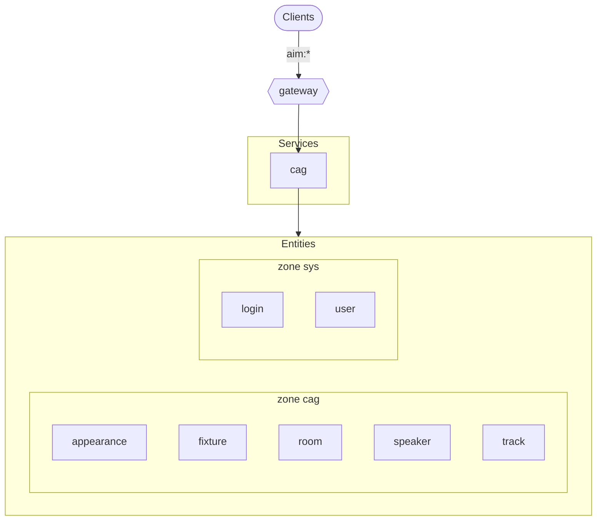
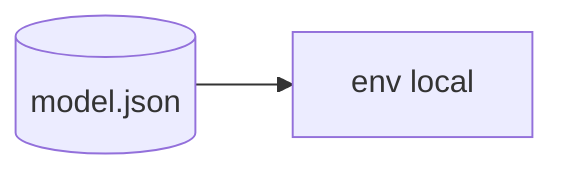

# Reference: system map (generated)

<!-- AUTO-GENERATED from the model by @voxgig/build (doc_gen) - do not edit. -->

*Diátaxis: reference — the system structure and its dependencies,
derived from the model.*

## Architecture

## Target environments

Active environments: `local`.

See also: [entities](entities.md) · [messages](messages.md).
