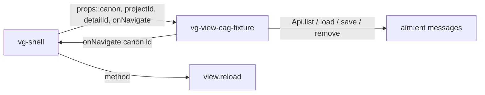

# Component: vg-view-cag-fixture (`cmp/view/cag_fixture.js`)

Hand-coded custom view for the `cag/fixture` entity — mounted by the shell
INSTEAD of the generic `vg-entity-admin`, because the model declares
`ux: { view: 'custom' }` on this entity. The component file is
create-once and developer-owned; document your design decisions here.

## Contract

| Member | Meaning |
|---|---|
| `canon` | `'cag/fixture'` |
| `projectId` | Current project id when project-scoped, else `null` |
| `detailId` | Entity id to open in detail, or `null` |
| `onNavigate(canon, id)` | Navigate elsewhere in the app |
| `reload()` | Re-fetch and re-render |

## Data

Use `Api` (`../../api.js`) — data flows through the generic
`aim:ent,cmd:*` messages, so membership scoping and validation apply
unchanged. Use `Model` (`../../model.js`) for labels, fields, and the
relationship graph.